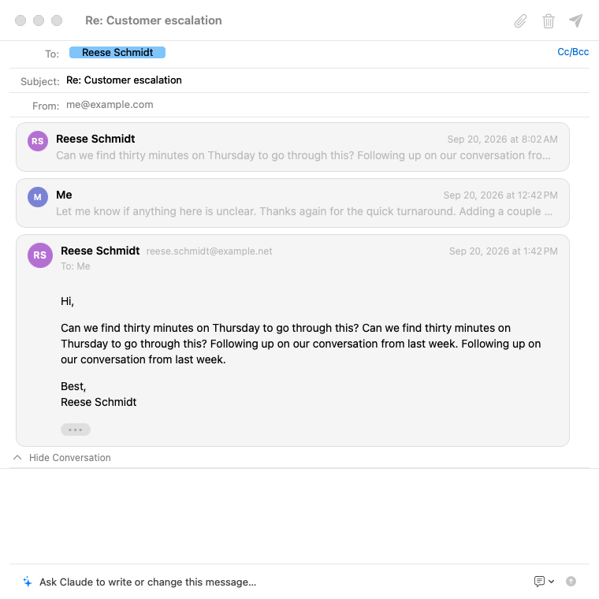
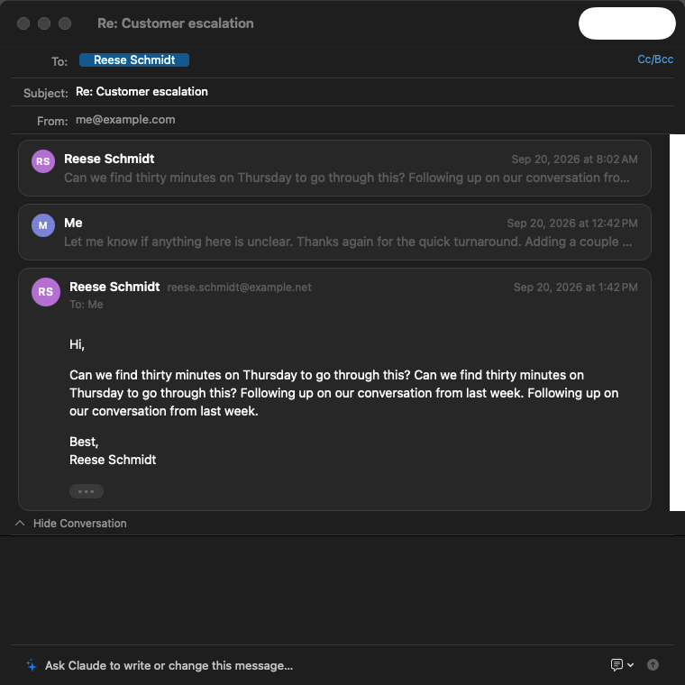

# OpenAGC design system

A small design system for the macOS app. It exists so that the app looks
like one piece, sits naturally next to Mail on macOS 26, and does not
repeat mistakes such as the rule under the list header that ran into the
floating sidebar (oagc-0cw).

The code lives in `macos/OpenAGC/Design/`:

| File | Holds |
| --- | --- |
| `Tokens.swift` | `Space`, `Radius`, `TypeRole`, `Tone` |
| `Surfaces.swift` | `glassCapsule()`, `card(_:)`, `bandBackground(_:)`, `columnHeader { }` |
| `Components.swift` | `ListHeaderBar`, `InsetRule`, `PaneDivider`, `Banner`, `LabelChip`, `CategoryChip`, `Dialog`, `CancelButton`, `TipCard`, `CapsuleTabs`, `hoverHelp` |
| `DueDay.swift` | how a task's due day reads and groups |

`docs/design-inventory.md` lists every pattern in the app against this
document (2026-09-29), with the inconsistencies still to fix.

`scripts/design-lint.sh` checks the rules below that a grep can check:
literal padding, stack or grid spacing and corner radii, a raw
`Divider()`, status colours not taken from `Tone`, and a Cancel that is not
a `CancelButton`. `scripts/help-lint.py` checks that every control has a
hover description and that none ends with a full stop.
`scripts/test-macos.sh` runs both in strict mode.

## Principles

1. **The system first.** Use the platform's own surfaces: the split view,
   toolbar, glass, scroll-edge effects, `ContentUnavailableView`, and
   system colours. Draw something custom only when the platform has
   nothing for it.
2. **Content goes edge to edge; chrome floats.** On macOS 26 the sidebar
   and toolbar float over content as glass. Columns extend beneath them.
   So nothing a column draws may assume where its visible edge is.
3. **Separation by space before lines.** Group with spacing and type
   weight. A rule is the last resort, and never a full-width one.
4. **One way to do each thing.** Each kind of notice has one surface and
   each kind of separator has one component.

## Tokens

### Spacing (`Space`)

| Token | pt | Use |
| --- | --- | --- |
| `hair` | 2 | inside chips; between a title and its subtitle |
| `xs` | 4 | icon to text; rows of a tight list |
| `s` | 6 | vertical padding of compact bars and banners |
| `m` | 8 | default gap between controls; vertical padding of capsules |
| `l` | 12 | horizontal padding of bars and banners in a column |
| `xl` | 16 | horizontal padding of glass capsules; panel padding |
| `xxl` | 20 | the reader's margins (as in Mail); gaps between sections |
| `xxxl` | 24 | sheet padding |
| `page` | 32 | full-window pages (onboarding) |

Nothing in between. When a layout seems to need 10, it gets 8 or 12. Zero
is always allowed. A measurement that aligns one thing with another (the
routine activity line under its name, past the icon) is a named constant
in its view, not a spacing token.

### Radii (`Radius`)

`chip` 4 (label chips), `control` 6 (attachment tiles, small filled
controls), `card` 8 (cards), `panel` 12 (floating panels). Capsules use
`.capsule`, never a large radius.

### Type (`TypeRole`)

| Role | SwiftUI | Where |
| --- | --- | --- |
| `title` | title3 semibold | the reader's subject; sheet titles |
| `heading` | headline | panel headings (the agent column's name) |
| `groupLabel` | subheadline semibold | groups inside a panel |
| `meta` | callout | bars, banners, notices, chips in SwiftUI |
| `caption` | caption | fine print |

The AppKit thread row uses `TypeRole.rowSender(unread:)` (13 pt, semibold
when unread), `rowSubject(unread:)` (12 pt, medium when unread),
`rowSecondary` (12 pt) and `chip` (11 pt medium).

The thread row is calm, as in Mail: sender and date, the subject, two
lines of preview, and a hairline (`separatorColor`) inset to the text
column between rows, hidden under the selection. The thread's message
count sits beside the date in the accent colour, not as "(3)" after the
names; a replied arrow sits under the unread dot when you answered; the
Important marker is left out where every row is Important.

### Colour (`Tone`)

Always system colours underneath, so light and dark, Increase Contrast and
the user's accent colour follow without extra work.

| Token | Is | Use |
| --- | --- | --- |
| `unread` / `unreadNS` | accent colour | the unread dot, as in Mail |
| `important` / `importantNS` | system yellow | Gmail's Important marker |
| `chipFill(hex:)` | label colour at 28 % | label chips; labels without a colour use tertiary label |
| `highlight` | tint at 25 % | the keyboard-highlighted item inside glass |
| `controlFill` | quaternary at 60 % | small filled controls (attachments) |
| `Intent.attention` | yellow at 14 %, outlined in cards | needs the user: sign in again, approve a send |
| `Intent.info` | tint at 10 % | worth knowing: created by an agent, your own prompt |
| `Intent.caution` | orange at 10 % | a consequence: a draft could not be saved |
| `Intent.neutral` | quaternary at 45 % | resting cards, the remote-images notice |

Status text takes its colour from `Tone`, never a literal:

| Token | Is | Use |
| --- | --- | --- |
| `failure` / `failureNS` | system red | something failed: an error line, a failed tool call, a failed run |
| `caution` / `cautionNS` | system orange | a consequence to weigh: an overdue task, a prompt missing its safety lines, unpublished changes, a request waiting on you |
| `approved` | system green | an approved agent action |
| `category(_:)` | a system colour per category | a task category's chip: one each for the starting set, others by name (never red, orange, yellow or pink) |

Red is only for failure (a failed tool call, an attachment error). Green
is only for "approved". Orange is text or a band's fill, never an error.

## Surfaces

| Surface | API | Rules |
| --- | --- | --- |
| Glass capsule | `.glassCapsule()` | Inset with a margin, never pinned to a column edge; no dividers inside. The undo notice floats over the list; the agent prompt sits in a strip of its own under the reader, since the reader's web view cannot leave room for anything floating over it. |
| Column header | `.columnHeader { … }` | A `safeAreaBar` at the top of a column with the hard scroll-edge effect. The content scrolls under it; the system draws the edge. It never draws its own rule. |
| Card | `.card(intent)` | On the background, in content. The only content with outlines (attention cards only). |
| Band | `Banner` (uses `.bandBackground`) | Full column width inside the column's safe area, tinted by intent, no rule above or below. |

## Components

- **`ListHeaderBar`**: the controls at the top of a column (the Inbox's
  Important-only switch, category tabs). Always inside `.columnHeader`.
- **`InsetRule`**: a separator between items inside a panel, inset on
  both sides. The only rule content may draw.
- **`PaneDivider`**: a vertical rule between two panes that share a
  column (the reader and the agent column), or between a sheet's content
  and its button bar.
- **`Banner`**: icon, one line and optional small buttons, by intent.
  `inset:` lines it up with the content it sits over (the reader uses
  `Space.xxl`).
- **`LabelChip`**: a label's name on its faint colour (SwiftUI). Thread
  rows draw the same chip as attributed text (`ThreadRowView`), in
  `TypeRole.chip` on `Tone.chipFill`, `Radius.chip`.
- **`CategoryChip`**: a task's category, the label chip's shape on the
  category's colour (`Tone.category`), so a category keeps its colour
  wherever it appears. `selected: true` gives the stronger fill used where
  a category is chosen (the task dialog's row of chips).
- **`TipCard`**: introduces a feature, as Mail introduces Categories: an
  icon, a title, one sentence, the main action and a dismiss ("Turn Off",
  "Not Now"). An info card under the Inbox's header, one tip at a time
  (`Tip`: Categories, Important Only, the agent); any button puts it away
  for good.
- **Empty states**: `ContentUnavailableView`, with a title, an SF Symbol
  and at most one sentence.
- **Menus** keep `Divider()` as their separator; mark the line `// menu`.
- **Hover descriptions:** every button, menu button, toggle and picker
  has a `.hoverHelp(...)` saying what it does, in a short sentence without a
  full stop, with its shortcut in parentheses when it has one ("Archive
  (e)"). Menu items, context-menu items and confirmation-dialog buttons
  show no tooltips on macOS and are exempt (mark `// no-help: <why>`
  where the check cannot tell). `scripts/help-lint.py --strict` runs in
  `test-macos.sh`. Why not plain `.help`: on macOS 26 SwiftUI's tool tips
  do not appear in column-header bars or on buttons in Settings forms
  (checked by hovering, 2026-09-28), and never reach the window toolbar.
  `.hoverHelp` adds an AppKit tool tip over the control that lets clicks
  through; toolbar buttons keep `.help` and `ToolbarHelp`, which
  `ToolbarToolTips` copies onto the toolbar items.

### Toolbar

The toolbar is laid out like Mail's: New Message in the list column's
toolbar (`ListToolbar`), at its trailing edge; then, from the reader's
leading edge, glass groups separated by `ToolbarSpacer(.fixed)`, from
most to least often used: reply, reply all and forward; archive, trash
and junk; label and star; then the agent's toggle; search at the
trailing edge. Each button has a help tag naming its shortcut, is
disabled rather than hidden when it has no target, and does exactly what
the matching Message menu item does.

## Patterns

### Dialogs (sheets)

`Dialog` is every sheet that asks for a decision or a short form: the task
dialog, Import Mailbox, a routine's prompt, the routine hand-off.

- A title in `TypeRole.title`, in title case, naming the action ("Import
  Mailbox", "New Task"); at most one sentence under it, secondary.
- `Space.xxxl` padding, `DialogMetrics.width` (460) unless the content
  needs its own size (a prompt editor passes `width: nil`).
- The button bar: extra actions leading ("Ask Again", "Reset to
  Generated"); trailing, `CancelButton` (Escape) and then the default
  action with `.keyboardShortcut(.defaultAction)` (Return, drawn
  prominent by the system). Help tags name the keys: "(Esc)", "(Return)".
- Focus starts in the first field (`@FocusState` set on appear).
- Work in progress shows inside the dialog (a small spinner and a line of
  secondary text ending in "…"), never as a second sheet.
- A **table sheet** (the agent's activity log) is the exception: the
  table runs edge to edge, with its button bar under a `PaneDivider`.

A one-question confirmation uses `confirmationDialog` (title a question,
the message the consequence, the destructive button with
`role: .destructive`). An `NSAlert` is only for a warning raised from
AppKit (the mismatched-link warning); its safe choice is first and the
default.

### Rows with a due day

The task list's rows are the thread row's calm style: the title where the
sender is, the category chip and the email's sender and subject on the
second line, and the due day in the date's slot at the trailing edge.

- The day reads as `DueDay.label`: "Today", "Tomorrow", "Yesterday", a
  weekday within the week ahead, else "Sep 12" (with the year when it is
  not this year's); "No date" is left blank in rows.
- Overdue days are drawn in `Tone.caution`; today's in the accent colour;
  others secondary. Red stays for failure.
- Rows group under `DueDay.Group` headings, in this order: Overdue, Today,
  This Week, Later, No Date. Days are `YYYY-MM-DD` in the user's
  calendar, never instants.

### Status lines, progress and errors

- A list's subtitle is its status line: parts joined with " · " (the
  category, "N unread", "Important only", "Filtered: …"). A missing value
  in a grid is "—".
- Progress: a `.small` spinner beside secondary text ending in "…" for
  unknown lengths; a linear bar for known totals; `.mini` spinners inside
  rows and cards.
- An error is a line of `Tone.failure` text in the surface it concerns
  (`TypeRole.caption` under a control, `TypeRole.meta` in a pane), with the
  `exclamationmark.triangle` symbol when it stands alone. A caution is the
  same in `Tone.caution`. A state that needs the user across the window
  (sign in again) is a `Banner(.attention)`.
- Empty lists use `ContentUnavailableView` when they fill a column; inside
  a form or a list section, one secondary line ("No runs yet").

### Reader

The reader is HTML (`EmailDocument`), so it cannot use the tokens
directly; its CSS keeps to the same scale.

- One card per message (`
`): an initials avatar (32 pt, 26 when
  collapsed), the sender, the date in the reader's style, and the body.
  The latest and unread messages open; others show a one-line snippet.
- Mail that sets its own colours is drawn on **paper** in dark mode (white
  behind the sender's HTML, `Radius.card`): the app never recolours a
  sender's HTML.
- The subject is `TypeRole.title`; the header does not scroll (the web
  view scrolls inside the reader), so it is not a `.columnHeader`.
- Avatars in the reader and `AccountAvatar` should share one initials and
  colour function (inventory gap; oagc-068 follow-up).

### Composer

Header rows (From, To, Cc, Bcc, Subject) have a right-aligned secondary
label and an `InsetRule` under each; bars inside the composer (the quote
toggle, the writing-help bar, attachments) sit on an `InsetRule` at their
top, padded `Space.l`. The original message shows in a pane under the
editor (`VSplitView`), hidden with "Hide Original". The writing-help bar
has its own Undo for what it wrote; the app's undo notice is for mail
actions.

### Agent

The prompt is a glass capsule in a strip of its own under the reader (at
most 680 wide). Suggestions float over it as glass chips: ↑ and ↓ or Tab
move, Return chooses, Escape hides, and VoiceOver hears how many there
are. In the agent column, your prompt is a `.card(.info)`, the reply is
plain text, thinking and tool calls are disclosure groups, and a proposal
is a `.card(.attention)` while it waits and `.neutral` after. An agent
error is a `Tone.failure` line.

### Data grids

Diagnostics (the Sync Debugger, the Keyboard Shortcuts window) use `Grid`
with `horizontalSpacing: Space.xl, verticalSpacing: Space.xs`: labels
secondary in `TypeRole.meta`, values with monospaced digits; a table's
header row in caption semibold, secondary. Section titles are
`TypeRole.groupLabel`. Timestamps may show seconds here and only here.

### Settings

Settings panes are grouped `Form`s. Section headers in title case; footers
plain (grouped forms already draw them secondary). A button that deletes
something the user cannot get back sits behind a confirmation.

## Behaviour

### Act, then offer Undo

Mail actions happen at once and offer Undo in the undo notice (a glass
capsule over the list for 8 s, paused while hovered or focused, one at a
time, announced to VoiceOver, "Archived 3 conversations"). Confirm only
what cannot be undone: removing an account, deleting mail data or a
routine, discarding a draft. The undo notice is for undoable actions; an
error that follows an action is an error line or a banner, not a notice
with an Undo button. Task actions (done, delete) undo the same way.

### Keys

- **Single keys act in the focused list**, with no modifier held, as in
  Gmail: `e` archive, `r` reply, `a` reply all, `f` forward, `s` star,
  `l` label, `u` unread, `#` trash, `!` junk, `j`/`k` next and previous,
  `/` search, `c` new message, `⌫` trash, `↩` open. `t` asks Claude for a
  task and `⇧T` opens bulk task creation. In the task list the same keys
  act on the task: `↩` edit, `r`/`a`/`f` answer its email, `e` done,
  `c` category, `⌫` delete.
- **⌘ keys live in menus**, and act only while the mail window is key.
- Help tags name the key the user presses where the control is: single
  keys in lower case ("Archive (e)"), menu keys with their symbols ("Move
  to Trash (⌘⌫)"), "(Return)" and "(Esc)" in dialogs.
- Every key is in the Keyboard Shortcuts window (⇧⌘/).

### Dates

Rows use `RowDateFormatter` (time today, weekday this week, else a short
date); the reader uses a medium date with a short time; tables use month,
day, hour and minute; due days use `DueDay`. Seconds only in diagnostics.

### Accessibility and focus

- A row reads as one label, its parts comma-joined, with VoiceOver custom
  actions for what its swipes and keys do.
- Icon-only controls have a label; decorative images (avatars) are hidden.
- Anything that selects on click is a `Button` or carries `.isButton`.
- Transient UI (the undo notice, suggestions) is announced.
- A dialog or popover focuses its first field when it opens; ⌘F and ⌘K
  move focus to search and the agent prompt.

### Motion

Animations are short (0.15 to 0.25 s, `.snappy` or `.easeOut`) and skipped
when Reduce Motion is on.

## Rules

1. **No full-width rules across a column's edge.** Columns extend
   beneath the floating sidebar, so a rule drawn "across the column" shows
   through the sidebar's glass. Use `.columnHeader` or `InsetRule`.
2. **Nothing drawn under the floating sidebar.** Backgrounds and bands
   stay inside the column's safe area. Do not `ignoresSafeArea` a fill in
   the content column.
3. **No dividers inside glass.** Group inside a capsule with spacing.
4. **Headers are safe-area bars.** Any bar at the top of a scrolling
   column is a `.columnHeader`, so the scroll edge belongs to the system.
5. **Tokens only.** No literal padding, stack or grid spacing, corner
   radius or status colour outside `Design/`; the lint checks it.
6. **Every state in light and dark.** A change to a surface comes with
   snapshots in both appearances (`scripts/snapshot.sh out.png
   -OpenAGCSnapshotAppearance dark`).

## Snapshots

Self-snapshots cannot capture glass (the sidebar, the toolbar's glass
groups and capsules come out blank or white), so these show layout and
colour, not materials. Refresh them with `scripts/snapshot.sh`.

| Light | Dark |
| --- | --- |
|  |  |
|  |  |
|  | |
|  |  |
|  |  |
|  |  |
|  |  |
|  |  |
|  |  |
|  |  |
